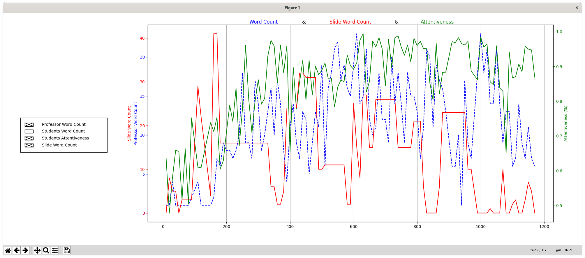

# ECE_Team9_Capstone
### AI teaching assistant. Facial recognition and behavioral processing.


## Description
This project will allow a user, such as a professor, to record their lecture and their student’s response to different moments within that lecture. These recordings will be uploaded and processed. The user will receive a report back from this program that describes to them how their students responded to different moments throughout that lecture (description detailed in “Requirements”). The user can then use this feedback to modify their future teaching behaviors to maximize student interaction or student attentiveness in accordance with their goals and repeat the analysis.


## Requirements
This project was built with python 3.8 (it might work with over versions)

This project was tested with Windows and Linux.

## Installation Introduction
Our program is fit on 32 or 64-bit Static version in Linux (Ubuntu) and Windows system.

### Linux (Ubuntu) Install

#### nvidia stuff

1. install nvidia drivers
check which driver is best for you
```
ubuntu-drivers devices
```
This will display a list of drivers available to you one of them will have the tag `recommended` install this one with

```
sudo apt install <nvidia-driver-recommended>
```

2. install cuda
This program is gpu accelerated (MTCNN) if you dont have a gpu, you can still run this program by going into `core.py` and removing the (num_gpus=1) above the student_call function (it will be very slow though).

```
sudo apt install nvidia-cuda-toolkit
```

Check if this worked by typing

```
nvcc --version
```

You should see `release 10.1` 

3. install cudnn
Since Nvidia is proprietary, you will not be able to download cudnn through the terminal. You will need to go to this website https://developer.nvidia.com/rdp/form/cudnn-download-survey, but its not enough for Nvidia to just require you to download it from their site, Nvidia is so proprietary that you have to create an account to download the package. so do that.

```
tar -xzvf cudnn-11.0-linux-x64-v8.0.2.39.tgz

sudo cp cuda/include/cudnn*.h /usr/local/cuda/include
sudo cp cuda/lib64/libcudnn* /usr/local/cuda/lib64
sudo chmod a+r /usr/local/cuda/include/cudnn*.h /usr/local/cuda/lib64/libcudnn*
```

#### Other third Party Dependencies

linux makes things easy

```
sudo apt install swig ffmpeg tesseract-ocr tesseract-ocr-eng
```
easy


### Windows install
1. Download FFmpeg

[ffmpeg](https://ffmpeg.org/) needs to be installed and added to your [path](https://helpdeskgeek.com/windows-10/add-windows-path-environment-variable/)

2. install swig
[swig](http://www.swig.org/Doc1.3/Windows.html) and add it to your path

3. [tesseract](https://digi.bib.uni-mannheim.de/tesseract/tesseract-ocr-w64-setup-v4.0.0-rc3.20181014.exe)

[here](https://medium.com/quantrium-tech/installing-and-using-tesseract-4-on-windows-10-4f7930313f82) is a good install instructions

## Python Environment Linux

Install conda

It is a good idea to not run your systems python, especially when working with tensorflow. So set up a virtual environment with conda.
```
wget https://repo.anaconda.com/archive/Anaconda3-2021.05-Linux-x86_64.sh
bash Anaconda3-2021.05-Linux-x86_64.sh 
```
Follow the installation prompt, when prompted to initialize anaconda type yes. close your current terminal and open a new one and it should say (base) in front of your terminal prompt. (base) is to let you know that you are baesd, meaning that you are currently using the default conda environment.

Now set up the tensorflow environment which is used for this program.

```
conda create --name tf tensorflow-gpu python=3.8
conda activate tf
pip --upgrade tensorflow==2.5.0 tensorflow-gpu==2.5.0
```

Now you should see that you are no longer based but now in the (tf) environment. now you can go ahead to the get code section below

### double check tensorflow

tensorflow is an absolute nightmare to set up (although it is getting better), so try running this

```
python

>>> import tensorflow as tf
```
if you get an error along the lines of `undefined symbol: _ZN10tensorflow8OpKernel11TraceStringEPNS_15OpKernelContextEb`

what *might* help is

```
pip install -U tensorflow==2.3.0 tensorflow-gpu==2.3.0
```

then after that is done go back to 2.5

```
pip install -U tensorflow==2.5.0 tensorflow-gpu==2.5.0
```

dont ask me why [this](https://github.com/tensorflow/text/issues/385) works, try not to get frustrated over setting up tensorflow google is a small company and is trying its best

## Get Code

```
git clone https://github.com/jb-codemaker/ECE_Team9_Capstone.git
pip install -r requirements.txt
```

## Usage

First have two video files of a lecture, one facing the students and one facing the instructor. Move those files to the data directory. For this example the file facing the students will be called students.mov and the file facing the teacher will be called teacher.mov. To run the program you will need to do the following commands

```
cd src/
python core.py ../data/students.mov ../data/teacher.mov
```

Thats it you should recieve a link to the ray dashboard. If you copy that and paste it in your browser you can see which sections of the program are running. Once the program is all done an interactive graph will show up



if you dont want this to pop up automatically you will need to go into core.py and remove the line `visualize(file_name)` at the bottom. If you want to display this graph without running the entire program again simply run the command

```
python visualize_data.py ../data/all_data.csv
```
